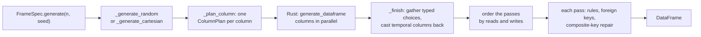
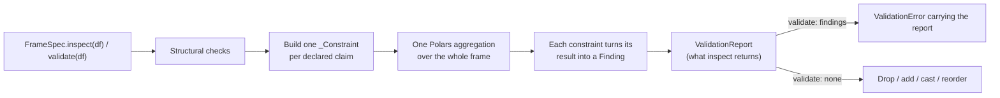

# Architecture

polspec is a small Python package over a Rust extension. The Python side owns
the vocabulary — what a column can declare and what that means; the Rust side
owns only the inner loop that fills arrays with values.

## Modules

| Module | Responsibility |
|:--|:--|
| `bound` | An inclusive `[min, max]`, either end optionally open |
| `check` | A named boolean expression, with SQL-style null handling |
| `constants` | Default generation ranges |
| `dtypes` | What each dtype can actually hold |
| `distributions` | The distributions available, and each one's parameter aliases |
| `spec` | `ColSpec` — one column's declaration, and everything it validates about itself |
| `rules` | `ColRule` — conditional values, and the pass that applies them |
| `foreign_key` | `ForeignKey` — declaration, and the pass that makes generated keys consistent |
| `engine` | Turning a spec into the `ColumnPlan` the Rust extension takes, and finishing the result: gathering typed choices, casting temporal columns back. A `List` wraps the column its elements make and a `Struct` gathers the columns its fields make, each by calling back into one-column generation |
| `_ffi` | The only module that imports the Rust extension (lazily), building plans and re-raising its errors as `GenerationError` |
| `errors` | The `PolspecError` hierarchy |
| `constraints` | What both sides read: `Domain` (the values a column may hold) and `Pass`/`order` (which rewrite of a generated frame runs first) |
| `validation` | `inspect` and `validate` over a `TableSpec`: every claim becomes a `_Constraint` that produces a `Finding`. The `constraints/` package holds them by kind: `_values` (one value's domain, bounds, length, format, pattern, recursing into a struct's fields and lifted over a list's elements), `_rules`, `_table` (composite keys, checks), `_relations` (foreign keys, hierarchy); `report.py` holds `Finding` and `ValidationReport` |
| `tablespec` | `TableSpec` — a spec as an immutable value, with its declaration-time checks and structural operations |
| `framespec` | `FrameSpec` — the metaclass that builds a `TableSpec` from a class body, and the facade forwarding every verb to it |
| `generation` | `generate`, `generate_batches`, `scan` and the file sinks, as functions over a `TableSpec`; `composite.py` separates a `__unique_together__` group; `seeds.py` keys every pass's seed by name, as the engine keys columns; `scan.py` is the lazy source every sink writes out |
| `frames` | The frame plumbing every verb shares: accepting a `DataFrame` or `LazyFrame`, and resolving `references=` to parent frames |
| `_options` | One way to take options -- an options object, keywords, or neither -- shared by `validate`, `inspect` and `drift` |
| `expr` | `col()`: a small predicate language that evaluates like Polars and survives a trip through a file |
| `formats` | Named string formats -- what each looks like, said once for generation and validation |
| `hierarchy` | `Hierarchy` -- a self-referencing link table, and the pass that builds one |
| `drift` | `diff` and `drift`: what changed between two specs, or between a spec and data. `fields.py` holds one comparator per `ColSpec` field, `data.py` measures a frame in the declaration's terms |
| `sizing` | `estimated_size`: a frame's memory, read off the declaration |
| `reading` | `read`: a data file in a spec's terms -- the reader chosen by extension, a declared date or time that arrived as text parsed. The CLI reads through the same table |
| `catspec` | `CatSpec` — a shared registry of enums and categoricals, as a value, plus the metaclass that builds one from a class body (the same split as `tablespec`/`framespec`) |
| `registry` | `Registry` — a declared set of specs: resolving cross-spec keys, ordering parents before children, `generate_all`/`validate_all`, one file and one diagram for the set |
| `serialization` | Spec files: a field registry (`fields.py`) that YAML, generated Python and the `import datetime` decision all derive from; the dtype codec table (`dtypes.py`); format versions and migrations (`migrations.py`) |
| `profiler` | Inferring a spec from an existing DataFrame |
| `report` | Rendering a spec, or a registry of them, as Markdown or Mermaid |
| `cli` | The `polspec` command, one module per verb: `_schema` (infer, new), `_data` (validate, generate), `_drift` (diff, drift), `_test`; `_io` holds the readers, writers and spec loaders they share |

The dependency direction is one-way: `spec` and `tablespec` know nothing about `framespec`,
and `report` is not reachable from either the generation or validation path.

## Generating

Each column becomes a `ColumnPlan` — kind, nullability, exact bounds, domain
size and weights, lengths, distribution — crossing into Rust once. Rust fills the
columns in parallel, and within a column in 65,536-row chunks whose seeds come
from the chunk index, so output is identical regardless of thread count.

For a fixed-width column a chunk is a unit of work, not a unit of storage. The
values buffer and the validity bitmap are each allocated once at the column's
full length, and a chunk fills its own disjoint slice of both — which is why
the chunk size is a multiple of 8, so the bitmap divides on a byte boundary and
no two threads touch the same byte. The column reaches Polars as a single
chunk, so nothing downstream — the gather behind a `choices` domain, the cast
behind a temporal dtype, a `sink_*` write — pays for a column split into
hundreds of pieces.

String columns are the exception: a row's width is not known until it is drawn,
and Polars backs them with view arrays, which merge by copying sixteen bytes of
view per row. That costs more than the split it would remove, so a long string
column stays chunked.

Rules and foreign keys are applied afterwards as vectorised passes over the
finished frame, not row by row. Each pass declares the columns it reads and
the ones it writes, and `constraints.order` runs them so no pass reads a
column a later one rewrites: a rule keyed on a foreign-keyed column sees the
parent's values, and a self-referencing key drawing from a foreign-keyed
column draws from values that are actually there. That ordering is what makes
generated data satisfy the same claims validation checks it against — which
is why a spec whose passes cannot be ordered is refused at declaration rather
than generated and then failed by its own spec.

Seeds are drawn per pass in declaration order, so which order they end up
running in does not change the values any one of them samples.

A `unique=True` column never reaches a pass: the engine draws it without
replacement in the first place (`src/unique.rs`), shuffling a materialised
domain when the domain is barely bigger than the frame and rejecting against a
set when it is roomy. A `__unique_together__` group is a pass, because
distinctness across columns can only be judged once they all exist: it
resamples the rows repeating a combination, and reads every member so it runs
after the rules and keys that settle them.

## Validating

Every claim a spec makes becomes a `_Constraint` that contributes aggregation
expressions and turns the results back into a `Finding`: a code, a count,
samples, code-specific details, and a lazy filter that locates the rows. They are collected
first and evaluated together, so validating a wide table costs one scan rather
than one per column. Foreign keys are the exception: each needs its own
anti-join against a parent frame.

Adding a new kind of check means adding a class, not editing two distant loops.

## The Python / Rust boundary

Python builds one `ColumnPlan` per column -- a `#[pyclass]` in `src/plan.rs`
that validates itself at construction, so an unknown kind, a weight vector of
the wrong length or a distribution parameter out of range is refused with a
message naming the column before any sampling starts. `polspec/_ffi.py` is the
only module that imports the extension, lazily: validation, spec files and the
registry work without a built extension, and only generation asks for one.

Rust knows about *kinds*, not about polspec's vocabulary: `int8` .. `uint64`,
`float32`/`float64`, `bool`, `string`, and `index`. `Date` crosses as an
`int32` day count and `Datetime`/`Duration`/`Time` as an `int64` in their own
unit. Anything with a finite domain -- `choices`, an `Enum`, a
capacity-limited `Categorical` -- crosses as `index` with the domain's size
and weights; Rust returns `UInt32` indices and Python gathers the typed values
back, so a `datetime` or a `bytes` choice never passes through a string.

Bounds cross as a `Limit`: an `i64`, a `u64` or an `f64`, whichever holds the
Python value exactly, so `Int64` and `UInt64` bounds keep every bit.

Distribution parameter *aliases* live only in `polspec/distributions.py` and
are resolved when a column is declared; `src/dist.rs` reads canonical keys and
exports its table as `distribution_params()`, which a test compares with the
Python one. Each column's seed is derived from the frame seed and the column
*name* (`sample.rs`), so inserting a column never reshuffles its neighbours.
`src/sample.rs` and `src/unique.rs` have no Python types and carry the unit
tests `cargo test` runs; `python/polspec/_polspec.pyi` is the stub, and a test asserts its names
match the module.

## Tests

`tests/` is grouped by what a file covers: `declaration/`, `generation/`,
`validation/`, `drift/` and `serialization/` follow the package, `features/`
holds one file per feature across every verb (structs, lists, formats,
foreign keys, ...), and `cli/` and `docs/` hold the command line and the
documentation's own checks. Each file opens with a docstring saying what it
covers, and a test holds the suite to both rules.

`contracts/` holds what keeps the design together rather than any one
feature: `test_roundtrip.py`, the property that anything `generate()`
produces `validate()` accepts, across every dtype; `test_streaming.py`, the
same property through `generate_batches()` and `scan()`, with what batching
promises on top; `test_properties.py`, the same again over specs Hypothesis
draws rather than ones anybody wrote; and `test_parity.py`,
which fails when a field is added without its serialization entry, its drift
comparator, its typed constructor parameter or its place in the facade's
signatures. Warnings are errors in the suite, so a warning is asserted where
it is expected and a failure everywhere else.
