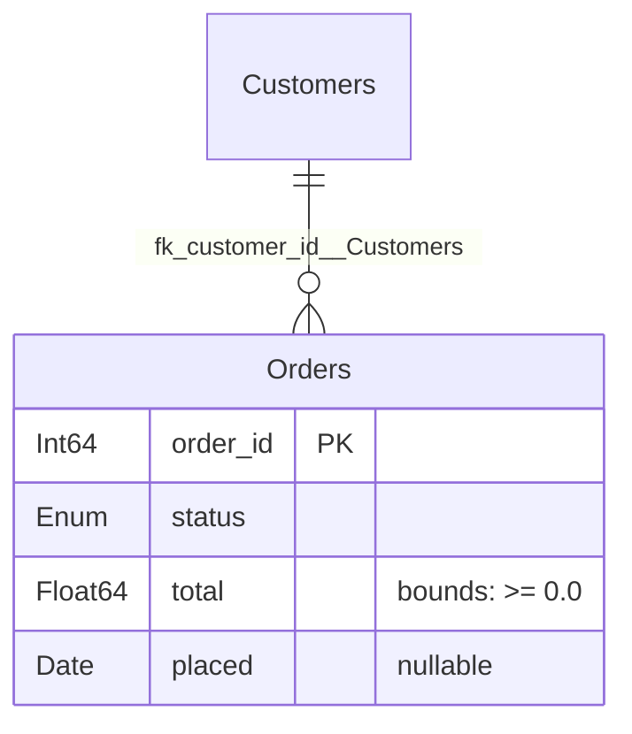

# Generated documentation

A spec already holds everything a data dictionary needs, so polspec renders one
rather than asking you to keep a second copy in step.

## Markdown data dictionary

```python
Orders.to_markdown("docs/orders.md")   # writes and returns
markdown = Orders.to_markdown()        # just returns
```

The document has three parts: an overview, a table of every column, and — when
the spec declares any — a constraints section covering composite keys, checks,
foreign keys, conditional rules and column validators.

```markdown
# Orders

## Overview
- **Schema:** `Orders`
- **Total Columns:** 4
- **Composite Unique Keys:** `['order_id', 'status']`
- **Foreign Keys:** 1 key(s)

## Columns

| Column | Type | Nullable | Bounds | Domain / Choices | String Length | Tags | Rules | Unique |
|:---|:---|:---|:---|:---|:---|:---|:---|:---|
| `order_id` | `Int64` | No | [1, 100000] | - | - | - | - | Yes |
| `status` | `Enum(['NEW', 'PAID', 'SHIPPED'])` | No | - | - | - | - | - | No |
| `total` | `Float64` | No | >= 0.0 | - | - | - | - | No |
```

Long category and choice lists are elided rather than blowing out the table,
and an open-ended bound reads as `>= 0.0` rather than `[0.0, None]`.

Pass `title=` to override the heading, which otherwise uses the class name.

## Entity-relationship diagram

```python
Orders.to_mermaid("docs/orders.mmd")
```



Columns are annotated with what the spec declares — nullability, bounds or
choices, tags, string lengths — and keyed as `PK` (a `unique` column), `UK` (a
member of a composite key) or `FK`.

Mermaid renders in GitHub, GitLab and most documentation sites, including this
one, so the diagram stays live rather than becoming a stale screenshot.

!!! note

    Every `unique=True` column is currently marked `PK`, so a spec with several
    unique columns renders several primary keys. `UK` would be the correct
    token for the non-primary ones.

## Documenting a category registry

`CatSpec` renders the same two ways:

```python
categories.to_markdown("docs/categories.md")
categories.to_mermaid("docs/categories.mmd")
```

The Markdown lists enums with their variants and categoricals with their
physical dtype, namespace and domain pool. The Mermaid output is a class
diagram, with each enum as an `<<enumeration>>`.

## Keeping generated docs current

Both renderers are pure functions of the spec, so wiring them into a build or a
pre-commit hook keeps the documentation honest:

```python
from pathlib import Path

for spec in (Customers, Orders, Shipments):
    spec.to_markdown(Path("docs/schemas") / f"{spec.__name__.lower()}.md")
```
