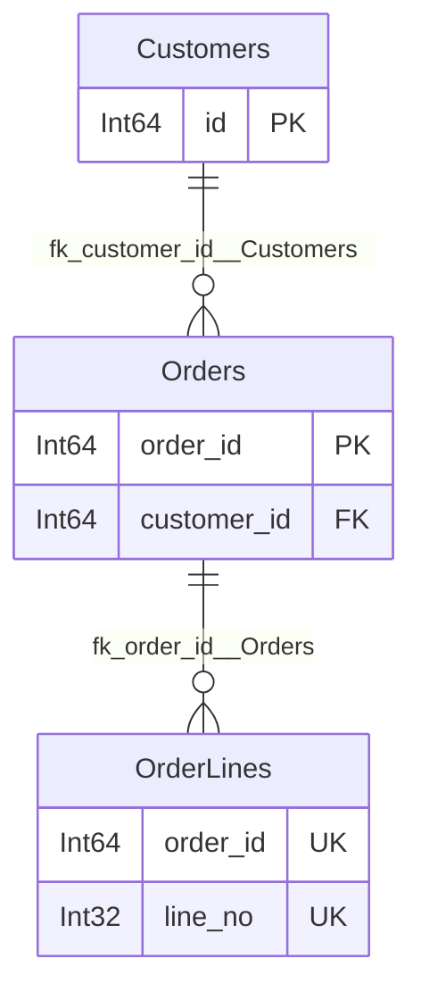

# Multiple specs

A `ForeignKey` names the spec it points at, and a single spec knows nothing
beyond that name. A `Registry` is the declared set of specs that belong
together: it resolves every cross-spec key, orders parents before children,
generates or validates the whole set in one call, and draws the relationships
between them.

```python
from polspec import Registry

registry = Registry(Customers, Orders, OrderLines)

registry.names            # ('Customers', 'Orders', 'OrderLines')
registry["Orders"]        # the TableSpec, by name, class or spec
registry.order()          # parents first: ('Customers', 'Orders', 'OrderLines')
```

A registry is declared, not global. Two test modules may each define an
`Orders`, and neither sees the other's. Two *different* specs with one name in
the same registry is an error.

## Resolving names

A key declared against a class is checked at declaration: the referenced
columns exist and their dtypes are compatible. A key declared against a bare
name, or read from a file, is not — nothing knows what `"Orders"` is yet.
`resolve()` binds every such key to the spec of that name and runs the same
checks, returning a new registry:

```python
resolved = registry.resolve()
resolved["OrderLines"].foreign_keys[0].target   # the Orders TableSpec
```

It raises `RegistryError` for a key whose target is not in the registry, for
a reference to a column the target lacks or cannot hold, for a cycle between
specs, and for a column disagreeing with the shared categories described
below.

## Generating a related set

`generate_all` walks the foreign-key graph, generates each parent before its
children, and threads every frame into `references=` for you:

```python
frames = registry.generate_all(1_000, seed=1)
frames["Orders"]["customer_id"]   # every value exists in frames["Customers"]["id"]
```

`n` is one count for every spec or a mapping with each spec's own:

```python
frames = registry.generate_all(
    {Customers: 1_000, Orders: 10_000, OrderLines: 30_000}, seed=1
)
```

Each spec's seed is derived from `seed` and the spec's name, so adding a
table to the registry never changes the rows another table produces. A frame
passed in `references=` is used as-is instead of being generated — real
customers under synthetic orders — and also stands in for a parent that is
not in the registry at all.

`generate_related(Orders, n)` is the same walk restricted to one spec and
everything it depends on.

## Validating a related set

```python
reports = registry.inspect_all(frames)     # {name: ValidationReport}
registry.validate_all(frames)              # raises once, listing every spec's findings
```

Every frame is a possible parent for every other, so no `references=` is
needed for keys inside the set; pass one for parents that live outside it.
Both take the options `validate()` does, and `validate_all` returns the frames
with the same structural transformations applied. A frame for a spec not in
the registry is a `RegistryError`.

## Shared categories

Declaring the registry with a `CatSpec` says which `Enum` and `Categorical`
definitions the specs are expected to share; `resolve()` then refuses a column
whose declaration disagrees with it:

```python
registry = Registry(Orders, Products, categories=categories)
registry.resolve()   # RegistryError if Orders.status and categories.STATUS differ
```

Without one, `catspec()` derives a registry from the specs' own columns and
refuses two specs that define the same name differently — the disagreement
[Shared categories](categories.md) warns about, now noticed:

```python
registry.catspec()   # CatSpec merged from every Enum/Categorical column
```

## One file for the set

A registry writes to a single YAML file: the format version, the declared
categories, and every spec keyed by name. Foreign keys are written as names
and bound again by `resolve()` on the way back:

```yaml
version: 2
categories:
  enums:
    STATUS: [NEW, PAID, SHIPPED]
specs:
  Customers:
    columns:
      id: {dtype: Int64, unique: true}
  Orders:
    columns:
      customer_id: {dtype: Int64}
      status: {dtype: {Enum: STATUS}}
    foreign_keys:
      - {columns: [customer_id], references: Customers, ref_columns: [id]}
```

```python
registry.to_yaml("specs.yaml")
registry = Registry.from_yaml("specs.yaml").resolve()
```

`categories:` may also be a path to a `CatSpec` file, relative to the registry
file. Everything [YAML specs](files.md) says about what survives a round-trip
applies to each spec in the file.

## Finding specs

`Registry.discover()` builds one from files and directories. A `.py` file is
imported and every `FrameSpec` subclass or `TableSpec` bound in it is taken;
a `.yaml` file is a spec, or a whole registry when it has a `specs:` key; a
directory is walked for both, skipping names starting with `_` or `test_`:

```python
registry = Registry.discover("specs/")
registry = Registry.from_module(my_project.specs)
```

Importing a Python file runs it, so point `discover` only at files you would
import anyway.

## The whole picture

`to_mermaid()` draws every spec and every key between them in one
entity-relationship diagram — the relationships a single spec's
[`to_mermaid`](documenting.md#entity-relationship-diagram) cannot see:

```python
registry.to_mermaid("docs/schema.mmd")
```


