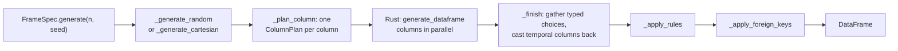
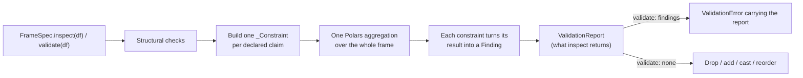

# Architecture

polspec is a small Python package over a Rust extension. The Python side owns
the vocabulary — what a column can declare and what that means; the Rust side
owns only the inner loop that fills arrays with values.

## Modules

| Module | Responsibility |
|:--|:--|
| `bound` | An inclusive `[min, max]`, either end optionally open |
| `check` | A named boolean expression, with SQL-style null handling |
| `constants` | Default generation ranges |
| `dtypes` | What each dtype can actually hold |
| `distributions` | The distributions available, and each one's parameter aliases |
| `spec` | `ColSpec` — one column's declaration, and everything it validates about itself |
| `rules` | `ColRule` — conditional values, and the pass that applies them |
| `foreign_key` | `ForeignKey` — declaration, and the pass that makes generated keys consistent |
| `engine` | Turning a spec into the `ColumnPlan` the Rust extension takes, and finishing the result: gathering typed choices, casting temporal columns back |
| `_ffi` | The only module that imports the Rust extension (lazily), building plans and re-raising its errors as `GenerationError` |
| `errors` | The `PolspecError` hierarchy |
| `validation` | `inspect` and `validate` over a `TableSpec`: every claim becomes a `_Constraint` (`constraints.py`) that produces a `Finding`; `report.py` holds `Finding` and `ValidationReport` |
| `tablespec` | `TableSpec` — a spec as an immutable value, with its declaration-time checks and structural operations |
| `framespec` | `FrameSpec` — the metaclass that builds a `TableSpec` from a class body, and the facade forwarding every verb to it |
| `generation` | `generate`, `generate_batches` and the file sinks, as functions over a `TableSpec` |
| `catspec` | `CatSpec` — a shared registry of enums and categoricals |
| `registry` | `Registry` — a declared set of specs: resolving cross-spec keys, ordering parents before children, `generate_all`/`validate_all`, one file and one diagram for the set |
| `serialization` | Spec files: a field registry (`fields.py`) that YAML, generated Python and the `import datetime` decision all derive from; the dtype codec table (`dtypes.py`); format versions and migrations (`migrations.py`) |
| `profiler` | Inferring a spec from an existing DataFrame |
| `report` | Rendering a spec, or a registry of them, as Markdown or Mermaid |
| `cli` | The `polspec` command: profiling data into a spec, blank specs, and generated tests |

The dependency direction is one-way: `spec` and `tablespec` know nothing about `framespec`,
and `report` is not reachable from either the generation or validation path.

## Generating

Each column becomes a `ColumnPlan` — kind, nullability, exact bounds, domain
size and weights, lengths, distribution — crossing into Rust once. Rust fills the
columns in parallel, and within a column in 65,536-row chunks whose seeds come
from the chunk index, so output is identical regardless of thread count.

Rules and foreign keys are applied afterwards as vectorised passes over the
finished frame, not row by row.

## Validating

Every claim a spec makes becomes a `_Constraint` that contributes aggregation
expressions and turns the results back into a `Finding`: a code, a count,
samples, code-specific details, and a lazy filter that locates the rows. They are collected
first and evaluated together, so validating a wide table costs one scan rather
than one per column. Foreign keys are the exception: each needs its own
anti-join against a parent frame.

Adding a new kind of check means adding a class, not editing two distant loops.

## The Python / Rust boundary

Python builds one `ColumnPlan` per column -- a `#[pyclass]` in `src/plan.rs`
that validates itself at construction, so an unknown kind, a weight vector of
the wrong length or a distribution parameter out of range is refused with a
message naming the column before any sampling starts. `polspec/_ffi.py` is the
only module that imports the extension, lazily: validation, spec files and the
registry work without a built extension, and only generation asks for one.

Rust knows about *kinds*, not about polspec's vocabulary: `int8` .. `uint64`,
`float32`/`float64`, `bool`, `string`, and `index`. `Date` crosses as an
`int32` day count and `Datetime`/`Duration`/`Time` as an `int64` in their own
unit. Anything with a finite domain -- `choices`, an `Enum`, a
capacity-limited `Categorical` -- crosses as `index` with the domain's size
and weights; Rust returns `UInt32` indices and Python gathers the typed values
back, so a `datetime` or a `bytes` choice never passes through a string.

Bounds cross as a `Limit`: an `i64`, a `u64` or an `f64`, whichever holds the
Python value exactly, so `Int64` and `UInt64` bounds keep every bit.

Distribution parameter *aliases* live only in `polspec/distributions.py` and
are resolved when a column is declared; `src/dist.rs` reads canonical keys and
exports its table as `distribution_params()`, which a test compares with the
Python one. Each column's seed is derived from the frame seed and the column
*name* (`sample.rs`), so inserting a column never reshuffles its neighbours.
`src/sample.rs` has no Python types and carries the unit tests `cargo test`
runs; `python/polspec/_polspec.pyi` is the stub, and a test asserts its names
match the module.

## Tests

| File | Covers |
|:--|:--|
| `test_roundtrip.py` | The property tying the two directions together: anything `generate()` produces, `validate()` accepts |
| `test_declaration.py` | Declaration-time contracts that never reach generated data |
| `test_generation.py` | Random and cartesian generation, dtype coverage, distributions, weights |
| `test_rules.py` | `ColRule`: what a rule may declare and which rows it touches |
| `test_serialization.py` | `to_yaml`/`from_yaml` and `to_python`, and what they warn about and drop |
| `test_profiler.py` | `from_dataframe` inference |
| `test_framespec.py` | The class body: inheritance, tags, `__checks__`, `__unique_together__`, validators |
| `test_report.py` | Markdown data dictionaries and Mermaid diagrams |
| `test_foreign_key.py` | `ForeignKey` declaration, persistence and generation |
| `test_validation.py` | Validation behaviour and error reporting |
| `test_inspect.py` | `inspect()`: findings as data, lazy failing rows, JSON |
| `test_tablespec.py` | `TableSpec` as a value: construction, structural operations, the metaclass |
| `test_expr.py` | The `col()` predicate language and its data form |
| `test_serialization_format.py` | The field registry, format versions, migrations, unknown keys |
| `test_registry.py` | `Registry`: resolution, ordering, `generate_all`/`validate_all`, files, discovery |
| `test_errors.py` | The exception hierarchy |
| `test_catspec.py` | Shared category registries |
| `test_streaming.py` | Batching and the file sinks |
| `test_cli.py` | The command line, including running a generated test file under pytest |
| `test_engine.py` | The Python / Rust boundary: typed plans, exact bounds, typed choices, per-column seeds, the stub |

The round-trip file carries `xfail(strict=True)` markers for known gaps, so a
fix turns the marker into a failure rather than passing unnoticed. See
[Known limitations](limitations.md).
