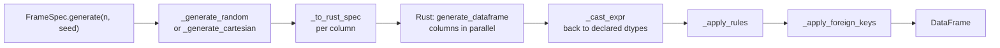
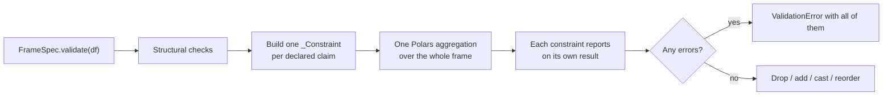

# Architecture

polspec is a small Python package over a Rust extension. The Python side owns
the vocabulary — what a column can declare and what that means; the Rust side
owns only the inner loop that fills arrays with values.

## Modules

| Module | Responsibility |
|:--|:--|
| `bound` | An inclusive `[min, max]`, either end optionally open |
| `check` | A named boolean expression, with SQL-style null handling |
| `constants` | Default generation ranges |
| `dtypes` | What each dtype can actually hold |
| `distributions` | The distributions available, and each one's parameter aliases |
| `spec` | `ColSpec` — one column's declaration, and everything it validates about itself |
| `rules` | `ColRule` — conditional values, and the pass that applies them |
| `foreign_key` | `ForeignKey` — declaration, and the pass that makes generated keys consistent |
| `engine` | Turning a spec into the tuple the Rust extension takes, and casting the result back |
| `validation` | Checking a frame against a spec |
| `framespec` | `FrameSpec` — collecting columns from a class body, and the public API |
| `catspec` | `CatSpec` — a shared registry of enums and categoricals |
| `serialization` | The YAML representation |
| `profiler` | Inferring a spec from an existing DataFrame |
| `report` | Rendering a spec as Markdown or Mermaid |
| `cli` | The `polspec` command: profiling data into a spec, blank specs, and generated tests |

The dependency direction is one-way: `spec` knows nothing about `framespec`,
and `report` is not reachable from either the generation or validation path.

## Generating

Each column becomes a flat tuple — kind, nullability, bounds, categories,
weights, lengths, distribution — crossing into Rust once. Rust fills the
columns in parallel, and within a column in 65,536-row chunks whose seeds come
from the chunk index, so output is identical regardless of thread count.

Rules and foreign keys are applied afterwards as vectorised passes over the
finished frame, not row by row.

## Validating

Every claim a spec makes becomes a `_Constraint` that contributes aggregation
expressions and turns the results back into a message. They are collected
first and evaluated together, so validating a wide table costs one scan rather
than one per column. Foreign keys are the exception: each needs its own
anti-join against a parent frame.

Adding a new kind of check means adding a class, not editing two distant loops.

## The Python / Rust boundary

Rust knows about *kinds* — `int64`, `float32`, `string`, `bool` — not about
polspec's vocabulary. `Date` crosses as an `int32` day count, `Datetime` as an
`int64` in its own time unit, `Enum` and `Categorical` as strings.

That keeps the extension small, at one cost worth knowing: bounds cross as
`f64`, so integer bounds beyond 2^53 lose precision. It is why the generation
clamp for an unbounded distribution is capped at 2^53 — a limit that rounds
outward would enforce nothing.

The distribution parameter aliases exist on both sides of the boundary, in
`polspec/distributions.py` and `DistKind::from_spec` in `src/lib.rs`. Both are
tables so the pair can be compared at a glance; they must be changed together.

## Tests

| File | Covers |
|:--|:--|
| `test_roundtrip.py` | The property tying the two directions together: anything `generate()` produces, `validate()` accepts |
| `test_declaration.py` | Declaration-time contracts that never reach generated data |
| `test_generation.py` | Random and cartesian generation, dtype coverage, distributions, weights |
| `test_rules.py` | `ColRule`: what a rule may declare and which rows it touches |
| `test_serialization.py` | `to_yaml`/`from_yaml` and `to_python`, and what they warn about and drop |
| `test_profiler.py` | `from_dataframe` inference |
| `test_framespec.py` | The class body: inheritance, tags, `__checks__`, `__unique_together__`, validators |
| `test_report.py` | Markdown data dictionaries and Mermaid diagrams |
| `test_foreign_key.py` | `ForeignKey` declaration, persistence and generation |
| `test_validation.py` | Validation behaviour and error reporting |
| `test_catspec.py` | Shared category registries |
| `test_streaming.py` | Batching and the file sinks |
| `test_cli.py` | The command line, including running a generated test file under pytest |

The round-trip file carries `xfail(strict=True)` markers for known gaps, so a
fix turns the marker into a failure rather than passing unnoticed. See
[Known limitations](limitations.md).
