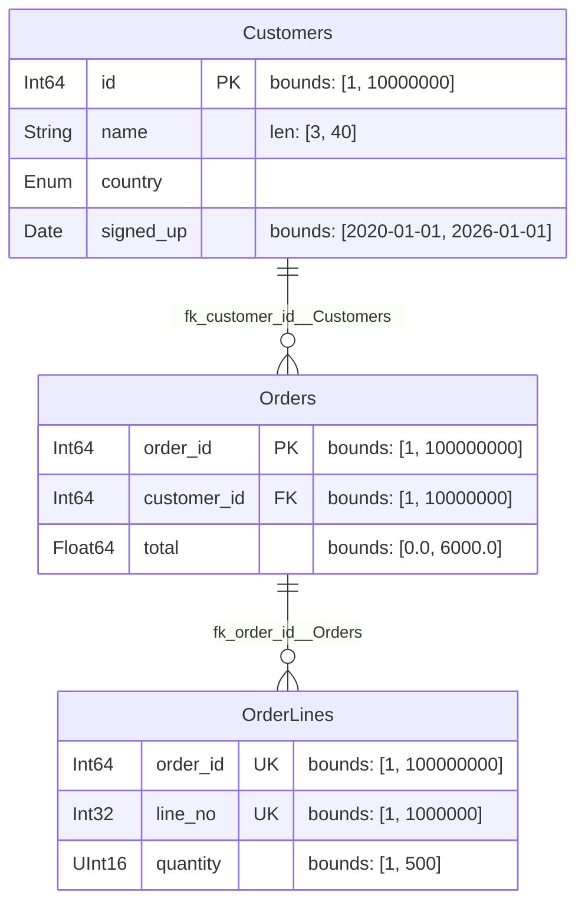

# Related tables

[Getting started](getting-started.md) covers one spec on its own. Real
schemas come in sets, with keys between them, and the interesting question is
how you generate a *consistent* set: orders whose `customer_id` values are
customers that exist.

This tutorial builds three related specs and generates all of them in one
call. The complete version, with more columns and a spec loaded from YAML,
lives in [`examples/related_specs.py`][example] in the repository and runs in
CI, so it cannot go stale.

  [example]: https://github.com/MaxwellB13/polspec/blob/main/examples/related_specs.py

## A parent

Nothing new here — a spec like any other. The `unique=True` on `id` matters
for what follows: it is what makes this a table other tables can point at.

```python
import datetime as dt
import polars as pl
from polspec import ColSpec, ForeignKey, FrameSpec, Registry

class Customers(FrameSpec):
    id        = ColSpec(pl.Int64, bounds=(1, 10_000_000), unique=True)
    name      = ColSpec(pl.String, string_length=(3, 40))
    country   = ColSpec(pl.Enum(["UK", "US", "DE"]))
    signed_up = ColSpec(pl.Date, bounds=(dt.date(2020, 1, 1), dt.date(2026, 1, 1)))
```

## A child

`__foreign_keys__` declares that `customer_id` only ever holds values that
exist in `Customers.id`.

```python
class Orders(FrameSpec):
    order_id    = ColSpec(pl.Int64, bounds=(1, 100_000_000), unique=True)
    customer_id = ColSpec(pl.Int64, bounds=(1, 10_000_000))
    total       = ColSpec(pl.Float64, bounds=(0.0, 6_000.0))

    __foreign_keys__ = [
        ForeignKey("customer_id", references=Customers, ref_columns="id"),
    ]
```

!!! note "The two `bounds` have to agree"

    `customer_id` is declared `(1, 10_000_000)` — the same range as
    `Customers.id`. That is not decoration. A key fills its column from the
    parent, so the parent's domain has to fit inside the child's; declaring
    `bounds=(1, 50)` here would be a contradiction, and polspec refuses it
    when you write the class rather than when you run it.

## A composite key

`OrderLines` points at `Orders`, and declares that no order has two lines
with the same number.

```python
class OrderLines(FrameSpec):
    order_id = ColSpec(pl.Int64, bounds=(1, 100_000_000))
    line_no  = ColSpec(pl.Int32, bounds=(1, 1_000_000))
    quantity = ColSpec(pl.UInt16, bounds=(1, 500))

    __unique_together__ = [["order_id", "line_no"]]
    __foreign_keys__ = [
        ForeignKey("order_id", references=Orders, ref_columns="order_id"),
    ]
```

## Generating the set

A `Registry` holds the specs that belong together. `resolve()` binds every key
to its target and checks the set is coherent; `order()` is the parents-first
order the keys imply.

```python
registry = Registry(Customers, Orders, OrderLines).resolve()

print(registry.order())
# ('Customers', 'Orders', 'OrderLines')

frames = registry.generate_all(1_000, seed=1)
```

`generate_all` walks that order and threads each parent frame into its
children, so every key is satisfied by construction:

```python
orders = frames["Orders"]
customers = frames["Customers"]
assert set(orders["customer_id"]) <= set(customers["id"])

registry.validate_all(frames)   # passes
```

Ask for different row counts per table by passing a mapping:

```python
frames = registry.generate_all(
    {"Customers": 1_000, "Orders": 5_000, "OrderLines": 20_000}, seed=1
)
```

Each spec's seed is derived from the registry seed and the spec's *name*, so
adding a fourth table does not reshuffle the three you already had.

## Drawing the result

`to_mermaid()` renders the set as an entity-relationship diagram — one entity
per spec, one line per key:

```python
print(registry.to_mermaid())
```



## Where to go next

- [Multiple specs](../how-to/registry.md) — the rest of what `Registry` does:
  discovery from a directory, one file for the whole set, shared categories.
- [Constraints](../how-to/constraints.md) — foreign keys in detail, including
  self-references and composite keys.
- [Specs as files](../how-to/files.md) — moving a spec out of Python entirely,
  which the full worked example does for one of its tables.
